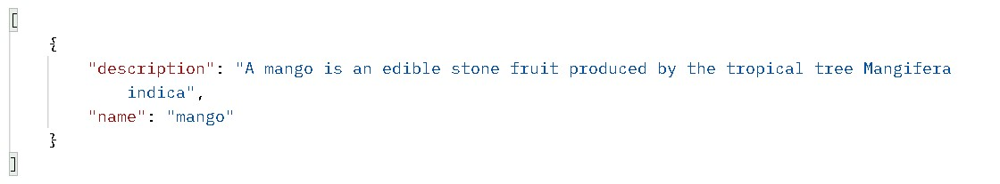

# CRUD-SQL
### Introduction
A simple backend service that creates,reads, update and deletes data in a SQL database with Python Flask.

# Sections in the article
### [Getting Started](##-getting-started)
### [Setting up virtual environment](##setting-up-virtual-environment)
### [Dependencies](##-dependencies)
### [Setting up codebase](##-setting-up-codebase) 
- [Importing dependencies](###-importing-dependencies)
- [Create flask instance](##-create-flask-instance)
- [Connect Database](###-connect-postgres-database)
- [Bind the SQLAlchemy instance to flask app](###-bind-the-sqlalchemy-instance-to-flask-app)
- [Create a model](###-create-a-model)
- [Create a table in database](###-create-a-table-in-the-database)
### [Create a new record](##-creating-a-new-record) 
### [Get a record](##-get-a-record)
### [Update A Record](##-update-a-record)
### [Delete A Record](##-delete-a-record)
## Getting Started
I expect you have the below listed already in your PC

- VsCode
- Python
- pgAdmin
- Postman
> Note: You can use other Code Editors , SQL Dialects and API testing tools but this is what i'll be using in this lesson, So now we are good to go yeah?

You can download vs-code [Here](https://code.visualstudio.com/download), Python [Here](https://www.python.org/downloads/), PgAdmin [Here](https://www.pgadmin.org/download/) and Postman [Here](https://www.postman.com/downloads/).

## Setting up Virtual Environment
I always recommend creating a virtual environment whenever you want to start a new python project. You can create that easily with the ``` python -m virtualenv venv ```

Now you'll activate the virtual environment with this command 
> Note: the ``` venv ``` is the name of the virtual environment, i assume we can proceed now.

## Dependencies

We'll need to install flask micro framework and flask_sqlalchemy

- flask
- flask_sqlalchemy
- psycopg2

we can install these dependencies by using the ``` pip install ``` i.e. ``` pip install flask ``` to install flask

Now let's move on.

## Setting up codebase
The First thing you want to do is create a file where your code will be written, let's name it app.py
 
In the project folder you can use ``` touch app.py ``` to create the file.

### Importing Dependencies
We'll import Flask, request and jsonify from flask and SQLAlchemy from flask_sqlalchemy

```
from flask import Flask, request, jsonify

from flask_sqlalchemy import SQLAlchemy

```

### Create Flask Instance
Now we'll create Flask Instance and name it app

```
app = Flask(__name__)

```
Now the next thing you want to do after you've set your pgAdmin up is create a database the name of my database is ``` hayley ```

### Connect postgres database
The next thing you want to do is connect the postgres database we'll be doing it this way

```
app.config['SQLALCHEMY_DATABASE_URI'] = 'postgresql://[Username]:[Password]@[Host]:[Port]/[Database name]'

```

Username = the default username is postgres

Password = it can be set blank if you didn't create any

Host = default is localhost

Port = default is 5432

Database name = the new database i created was named hayley.

### Bind the SQLAlchemy instance to flask app
Now the next thing we want to do is binding the SQLAlchemy instance to the flask app this way

```
db = SQLAlchemy(app)

```

### Create a model
We want to create a simple table that contains fruits and it's description.
We'll create the id which is an integer, name and description which are strings as seen below and then commit the transaction using ```  ```

```

class Fruit(db.Model):
    id = db.Column(db.Integer, primary_key=True)
    name = db.Column(db.String(), nullable=False)
    description = db.Column(db.String(), nullable=False)

```

### Create a table in the Database
Now we wan't to create the table in our Database with the commands below

```
# db.create_all()
# db.session.commit()

```

And your table should look like this in the Database when you run the ``` select * from "fruit"  ``` in query tool


## Creating a new record

To create a new record we'll name an endpoint ``` /new-fruit ``` with the ``` POST ``` method, a new variable name to get the name of the fruit from the json we'll be using in postman, another variable description to get the description of the fruit and a variable fruit which is an instance of the Fruit model that will be stored in the database. Now we'll add the fruit by using the SQLALchemy ``` db.session.add(fruit) ``` as seen below and then commit the transaction using ``` db.session.commit()  ```.

```
@app.route("/new-fruit", methods=["POST"])
def new_fruit():
    name = request.get_json()['name']
    description = request.get_json()['description']
    fruit = Fruit(name=name, description=description)
    db.session.add(fruit)
    db.session.commit()
    return jsonify("New Fruit created")

```

This is the new fruit we'll be adding from our Postman


And Our Fruit is now added into the table as seen below.


## Get A Record
The next method we'll be using is the ``` GET ``` method, we want to get all fruits in the table, the first thing we'll be doing is define a list named ``` all_fruits ``` then get all fruits with SQLALchemy ``` Fruit.query.all() ``` and assign it to fruits variable, then iterate through all the fruits and append an object that contains ``` fruit.name ``` and ``` fruit.description ``` into the ``` all_fruits ``` list as seen below then return it in JSON format as seen below.

```

@app.route("/fruits", methods=["GET"])
def get_fruits():
    all_fruits = []
    fruits = Fruit.query.all()
    for fruit in fruits:
        all_fruits.append({
            "name": fruit.name,
            "description": fruit.description
        })
    return jsonify(all_fruits)

```


this is how we'll be getting it from our Postman


And this is the response we get since we only have one fruit and it's description in the table.



## Update A Record
The next method we want to use is the ``` PATCH ``` method, we'll be using it to update an existing fruit name or it's description. The first thing we'll be doing is to get the particular fruit with SQLALchemy ``` Fruit.query.get(id) ``` containing the id of the fruit, then get both the name and description the same way we did in ``` POST ``` request and then assigned ``` fruit.name ``` to the new  ``` name ``` and ``` fruit.description ``` to the new ``` description ``` and then committing the transaction using ``` db.session.commit()  ```

```

@app.route("/update-fruit/<int:id>", methods=["PATCH"])
def update_fruit(id):
    fruit = Fruit.query.get(id)
    name = request.get_json()['name']
    description = request.get_json()['description']
    fruit.name = name
    fruit.description = description
    db.session.commit()
    return jsonify("Fruit Updated Successfully")

```

We'll be Updating the name from our Postman as seen below


And it should update in our table instantly


## Delete A Record
The Last method we'll be using is the ``` DELETE ``` method, we'll be using this to delete a fruit and it's description. The first thing we'll be doing is to get the particular fruit using SQLALchemy ``` Fruit.query.get(id)  ``` then use ``` db.session.delete(fruit)  ```
with the ``` fruit ``` instance in the delete() method, then we'll be commiting the transaction using ``` db.session.commit()  ```

```
@app.route("/delete-fruit/<int:id>", methods=["DELETE"])
def delete_fruit(id):
    fruit = Fruit.query.get(id)
    db.session.delete(fruit)
    db.session.commit()
    return jsonify("Fruit Deleted Successfully")

```

When we call the delete fruit endpoint with the id of the fruit as seen below``` /delete-fruit/1  ```


The table should be empty as seen below


Hope You Enjoyed it!
